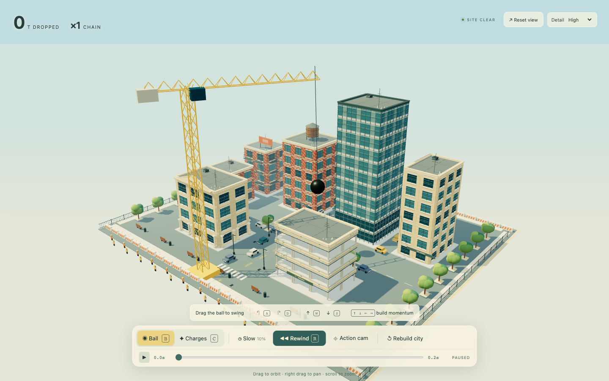

# 3D Worlds

**One prompt. Multiple builds.**

A showcase of independent, AI-built browser worlds: the same creative brief, tried with different models and reasoning settings. Each build keeps its own implementation, controls, dependencies, and rough edges.

Each prompt has a folder containing its original brief, independent builds, and previews:

```text
prompts/
  demolition-playground/
    PROMPT.md
    builds/
      gpt-5.5-xhigh/
      gpt-5.6-sol-ultra/
      gpt-6-astra-ultra/
      skills-build-loop/
    previews/
```

## Prompt 01 · Demolition playground

A sunlit downtown district built to be destroyed—and rebuilt. Wrecking cranes, demolition charges, structural collapse, slow motion, and a scrubbable rewind.

**[Browse this prompt and its builds →](prompts/demolition-playground/)** · [Read the complete original prompt](prompts/demolition-playground/PROMPT.md)

| Build | Lead model | Reasoning | Created | Source |
| :--- | :--- | :--- | :--- | :--- |
| [Demolition Site](#demolition-site) | GPT-5.5 | xhigh | July 7, 2026 | [Browse](prompts/demolition-playground/builds/gpt-5.5-xhigh/) |
| [District 08](#district-08) | GPT-5.6 Sol | ultra | July 9, 2026 | [Browse](prompts/demolition-playground/builds/gpt-5.6-sol-ultra/) |
| [Demolition District](#demolition-district) | GPT-6 Astra | ultra | September 4, 2026 | [Browse](prompts/demolition-playground/builds/gpt-6-astra-ultra/) |
| [Demolition Playground - Skills Build Loop (3 rounds)](#skills-build-loop) | GPT-6 Astra | max | September 15, 2026 | [Browse](prompts/demolition-playground/builds/skills-build-loop/) |

The three original prompt attachments have the same SHA-256 hash. Model and reasoning labels were recovered from the creation turns in local Codex records, rather than inferred from appearance or the task's latest settings. [Provenance and comparison notes](showcase/README.md) · [Machine-readable attempt catalog](showcase/attempts.json)

These were iterative coding sessions with different follow-up instructions, tools, and agent workflows. They are a showcase of resulting artifacts, not a controlled model benchmark or a ranking.

The existing comparison films cover the original three entries. They do not include the Skills Build Loop.

**[Watch the side-by-side preview](https://github.com/Drew-Goddyn/3d-worlds/releases/download/demolition-demo-v1/demolition-comparison.mp4)** · **[Download the synchronized viewer](https://github.com/Drew-Goddyn/3d-worlds/releases/download/demolition-demo-v1/demolition-viewer.zip)** · [All release assets](https://github.com/Drew-Goddyn/3d-worlds/releases/tag/demolition-demo-v1)

Three 70-second, 1080p films share camera framing and chapter timing: overview, one bank swing, then charges and native rewind. The downloadable viewer supports shared playback, seeking, chapters and focus mode. Extract the ZIP and open index.html.

Individual previews: [GPT-5.5 · Xhigh](https://github.com/Drew-Goddyn/3d-worlds/releases/download/demolition-demo-v1/gpt-5.5-xhigh.mp4) · [GPT-5.6 Sol · Ultra](https://github.com/Drew-Goddyn/3d-worlds/releases/download/demolition-demo-v1/gpt-5.6-sol-ultra.mp4) · [GPT-6 Astra · Ultra](https://github.com/Drew-Goddyn/3d-worlds/releases/download/demolition-demo-v1/gpt-6-astra-ultra.mp4).

These are labeled previews. Astra’s charges chapter includes unexplained capture holds up to 100 ms; native presentation between captures is unknown. Do not use the films for FPS or performance ranking. These films and preview images document the [original showcase checkpoint](https://github.com/Drew-Goddyn/3d-worlds/tree/ac854cea3d554f34f39ca9f91a3197ad422b79ee). The Astra application continues to evolve; its current source retains the accepted localized demolition and banking hall, with a new visual-and-acoustic demolition-event continuation awaiting review. Historical media and creation labels remain unchanged. [Evidence archive](https://github.com/Drew-Goddyn/3d-worlds/releases/download/demolition-demo-v1/demolition-evidence.zip) · [SHA-256 checksums](https://github.com/Drew-Goddyn/3d-worlds/releases/download/demolition-demo-v1/SHA256SUMS) · [Recorder and verification notes](showcase/demo/README.md).

### Demolition Site

**GPT-5.5 · xhigh**

[](prompts/demolition-playground/builds/gpt-5.5-xhigh/)

The earliest attempt: an unbundled Three.js sandbox with a compact control strip. Its original adversarial review is [preserved with the build](prompts/demolition-playground/builds/gpt-5.5-xhigh/docs/adversarial-review.md).

From the repository root:

```sh
PORT=4174 node prompts/demolition-playground/builds/gpt-5.5-xhigh/server.mjs
```

Open **http://127.0.0.1:4174**. Requires a current Node.js installation and internet access for the pinned Three.js browser imports. [Build documentation](prompts/demolition-playground/builds/gpt-5.5-xhigh/README.md)

### District 08

**GPT-5.6 Sol · ultra**

[](prompts/demolition-playground/builds/gpt-5.6-sol-ultra/)

A separate implementation with a styled district, crane controls, material effects, and timeline playback. The task requested distinct systems, experience, and executive roles; the recovered execution records identify Sol for the lead and the recorded helpers.

From the repository root, with **Node.js 22.13 or newer**:

```sh
npm --prefix prompts/demolition-playground/builds/gpt-5.6-sol-ultra ci
npm --prefix prompts/demolition-playground/builds/gpt-5.6-sol-ultra run dev -- --port 4175
```

Open **http://localhost:4175**. [Build documentation](prompts/demolition-playground/builds/gpt-5.6-sol-ultra/README.md)

### Demolition District

**GPT-6 Astra · ultra**

[](prompts/demolition-playground/builds/gpt-6-astra-ultra/)

Eight downtown buildings, an aimed wrecking crane, staged charges, source-geometry fragments, individual glass panes, a bursting water tank, and sixty seconds of reversible history. Three.js is vendored locally; no installation or runtime network access is needed.

From the repository root:

```sh
node prompts/demolition-playground/builds/gpt-6-astra-ultra/server.mjs
```

Open **http://127.0.0.1:4173**. [Build documentation](prompts/demolition-playground/builds/gpt-6-astra-ultra/README.md) · [Recorded verification](prompts/demolition-playground/builds/gpt-6-astra-ultra/evidence/verification.json)

```sh
npm --prefix prompts/demolition-playground/builds/gpt-6-astra-ultra test
```

### Skills Build Loop

**Demolition Playground - Skills Build Loop (3 rounds)** · **GPT-6 Astra · max**

[](prompts/demolition-playground/builds/skills-build-loop/)

One clarification round accepted six interpretations, followed by three implementation-and-review assignments. Grilling, Domain Modeling, Codebase Design, Build Loop, and Writing for Agents guided a separate ChatGPT thinking/review partner; a local coding-agent session implemented the build. Self-correction and reported independent reviews happened within assignments. This is a bounded, iterative workflow result. Three assignments do not imply three model calls, fixed total compute, or an isolated measurement of an individual skill's effect.

The original prompt is byte-identical to the shared brief. The six [agreed interpretations](prompts/demolition-playground/builds/skills-build-loop/docs/BUILD_BRIEF.md#agreed-interpretations) apply to this entry and remain separate. Model and effort were recovered from this attempt's creation records for all three assignments; the date is the implementation-session start date. [Provenance and creation settings](prompts/demolition-playground/builds/skills-build-loop/PROVENANCE.md).

From the repository root, with **Node.js 22 or newer**:

```sh
npm --prefix prompts/demolition-playground/builds/skills-build-loop ci
PORT=4176 npm --prefix prompts/demolition-playground/builds/skills-build-loop start
```

Open **http://127.0.0.1:4176**. Dependency installation needs npm packages; the running application loads its pinned Three.js dependency locally and needs no external scene assets or runtime network access.

The 52 frozen source files are unchanged. This remains a stylized diorama with coarse contacts, grouped debris, partial material effects and whole-tower leaning, and growing history. The longest reported run is 91 simulation seconds. [Final review and measurement boundaries](prompts/demolition-playground/builds/skills-build-loop/publication/evidence/reviewer/README.md).

## Adding another attempt

Create `prompts/<prompt-id>/PROMPT.md` for a new brief, or reuse the existing prompt folder when the brief matches exactly. Put each independent attempt in `prompts/<prompt-id>/builds/<model>-<reasoning>/` and its screenshot in the same prompt’s `previews/` folder. Use the verified creation settings in the folder name; add an attempt suffix for repeated runs of the same configuration. Save the exact prompt, record the model and reasoning setting **at build time**, note additional instructions or follow-up changes, and add an entry to [the catalog](showcase/attempts.json) with a real screenshot and a working local launch command. Group attempts by their shared prompt; keep prior outputs intact.

All previews above are actual browser captures at 1440 × 900. Existing root `npm run dev`, `check`, and `verify` scripts still belong to the first Demolition Site build; they are not aggregate checks for the showcase.
