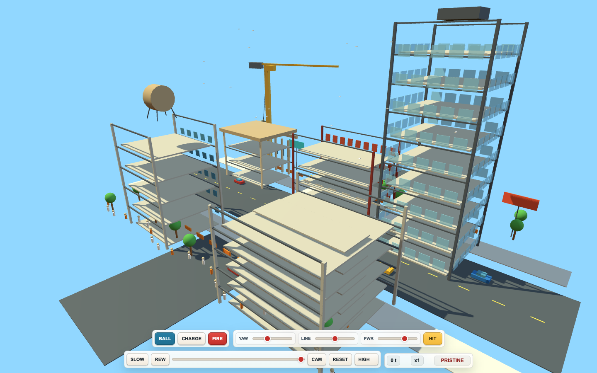
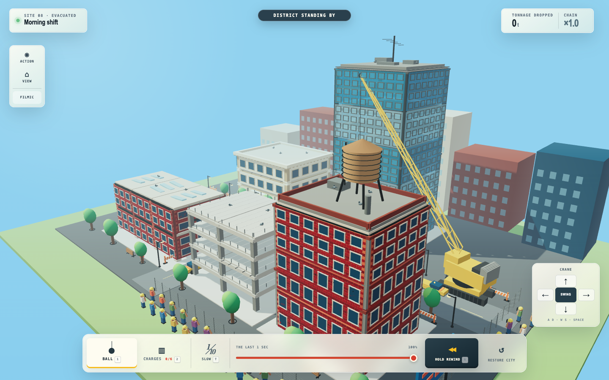
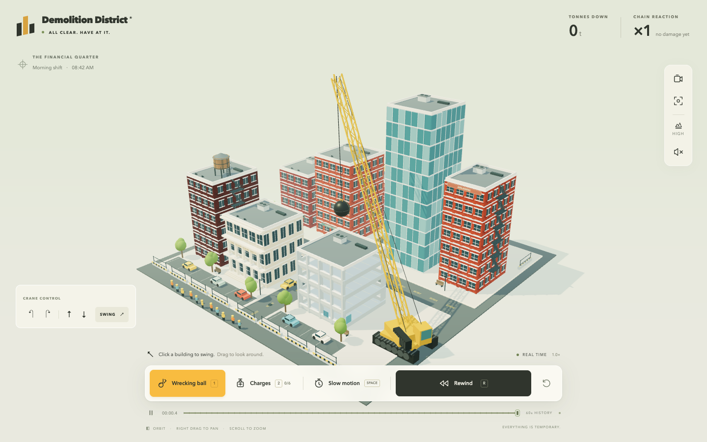

# 3D Worlds

**One prompt. Multiple builds.**

A showcase of independent, AI-built browser worlds: the same creative brief, tried with different models and reasoning settings. Each build keeps its own implementation, controls, dependencies, and rough edges.

Each prompt has a folder containing its original brief, independent builds, and previews:

```text
prompts/
  demolition-playground/
    PROMPT.md
    builds/
      demolition-site/
      district-08/
      demolition-district/
    previews/
```

## Prompt 01 · Demolition playground

A sunlit downtown district built to be destroyed—and rebuilt. Wrecking cranes, demolition charges, structural collapse, slow motion, and a scrubbable rewind.

**[Browse this prompt and its builds →](prompts/demolition-playground/)** · [Read the complete original prompt](prompts/demolition-playground/PROMPT.md)

| Build | Lead model | Reasoning | Created | Source |
| :--- | :--- | :--- | :--- | :--- |
| [Demolition Site](#demolition-site) | GPT-5.5 | xhigh | July 7, 2026 | [Browse](prompts/demolition-playground/builds/demolition-site/) |
| [District 08](#district-08) | GPT-5.6 Sol | ultra | July 9, 2026 | [Browse](prompts/demolition-playground/builds/district-08/) |
| [Demolition District](#demolition-district) | GPT-6 Astra | ultra | September 4, 2026 | [Browse](prompts/demolition-playground/builds/demolition-district/) |

The three original prompt attachments have the same SHA-256 hash. Model and reasoning labels were recovered from the creation turns in local Codex records, rather than inferred from appearance or the task's latest settings. [Provenance and comparison notes](showcase/README.md) · [Machine-readable attempt catalog](showcase/attempts.json)

These were iterative coding sessions with different follow-up instructions, tools, and agent workflows. They are a showcase of resulting artifacts, not a controlled model benchmark or a ranking.

### Demolition Site

**GPT-5.5 · xhigh**

[](prompts/demolition-playground/builds/demolition-site/)

The earliest attempt: an unbundled Three.js sandbox with a compact control strip. Its original adversarial review is [preserved with the build](prompts/demolition-playground/builds/demolition-site/docs/adversarial-review.md).

From the repository root:

```sh
PORT=4174 node prompts/demolition-playground/builds/demolition-site/server.mjs
```

Open **http://127.0.0.1:4174**. Requires a current Node.js installation and internet access for the pinned Three.js browser imports. [Build documentation](prompts/demolition-playground/builds/demolition-site/README.md)

### District 08

**GPT-5.6 Sol · ultra**

[](prompts/demolition-playground/builds/district-08/)

A separate implementation with a styled district, crane controls, material effects, and timeline playback. The task requested distinct systems, experience, and executive roles; the recovered execution records identify Sol for the lead and the recorded helpers.

From the repository root, with **Node.js 22.13 or newer**:

```sh
npm --prefix prompts/demolition-playground/builds/district-08 ci
npm --prefix prompts/demolition-playground/builds/district-08 run dev -- --port 4175
```

Open **http://localhost:4175**. [Build documentation](prompts/demolition-playground/builds/district-08/README.md)

### Demolition District

**GPT-6 Astra · ultra**

[](prompts/demolition-playground/builds/demolition-district/)

Eight downtown buildings, an aimed wrecking crane, staged charges, source-geometry fragments, individual glass panes, a bursting water tank, and sixty seconds of reversible history. Three.js is vendored locally; no installation or runtime network access is needed.

From the repository root:

```sh
node prompts/demolition-playground/builds/demolition-district/server.mjs
```

Open **http://127.0.0.1:4173**. [Build documentation](prompts/demolition-playground/builds/demolition-district/README.md) · [Recorded verification](prompts/demolition-playground/builds/demolition-district/evidence/verification.json)

```sh
npm --prefix prompts/demolition-playground/builds/demolition-district test
```

## Adding another attempt

Create `prompts/<prompt-id>/PROMPT.md` for a new brief, or reuse the existing prompt folder when the brief matches exactly. Put each independent attempt in `prompts/<prompt-id>/builds/<build-id>/` and its screenshot in the same prompt’s `previews/` folder. Save the exact prompt, record the model and reasoning setting **at build time**, note additional instructions or follow-up changes, and add an entry to [the catalog](showcase/attempts.json) with a real screenshot and a working local launch command. Group attempts by their shared prompt; keep prior outputs intact.

All previews above are actual browser captures at 1440 × 900. Existing root `npm run dev`, `check`, and `verify` scripts still belong to the first Demolition Site build; they are not aggregate checks for the showcase.
